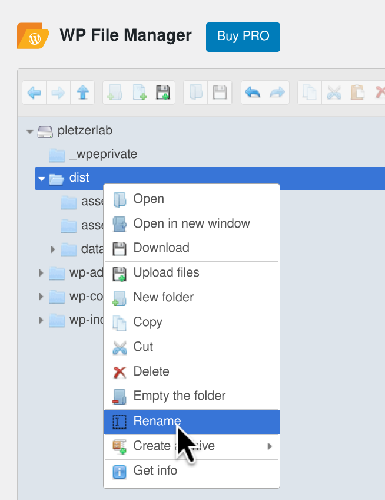

# Pletzer Lab Genome Browser
Genome browser website and related scripting utilities.
Made for Pletzer Lab by Elliott Brown.

## **Setup**
On first use, you must setup the dependencies for this project.

1. **Change into the root directory of this project:**

   ```bash
   cd pletzer-lab-genome-browser/
   ```
---

2. **Check what packages you're missing:**
    ```bash
    scripts/deps-check.sh
    ```

    On Ubuntu, the script should prompt you to install packages automatically (recommended).

    **Alternatively**, you can install dependencies manually:
      - Install the missing listed packages
      - Install npm dependencies:
        ```bash
        npm install
        npm install -g @jbrowse/cli
        ```
      - Install conda dependencies:
        ```bash
        conda env create --name plgb --file requirements.yaml 
        ```
---

3. **Run this to make sure commands are available:**
    ```bash
    export PATH="$HOME/miniconda3/bin:$PATH"
    source ~/.bashrc
    conda init
    conda activate plgb
    ```
---

## **User Guide**

To rebuild the website with new data, follow the steps below:


1. **Change into the root directory of this project and activate conda:**

   ```bash
   cd pletzer-lab-genome-browser/
   conda activate plgb
   ```
---

2. **Create a directory structure like so:**

    ```text
      data/
      ├── genome1_name/
      │   ├── refseq.fna
      │   ├── genes.gff
      │   └── reads/
      │       ├── condition1/
      │       │   ├── condition1.1.bam
      │       │   ├── condition1.2.bam
      │       │   ├── ...
      │       │   └── condition1.N.bam
      │       └── condition2/
      │           ├── condition2.1.bam
      │           ├── condition2.2.bam
      │           ├── ...
      │           └── condition2.N.bam
      │
      └── genome2_name/
          ├── ...
    ```

    Note:
    - `refseq.fna` is the reference sequence FASTA file, containing the nucleotide sequence.
    - `genes.gff` is the genes file, containing the coordinates and names for each gene.
    - `reads/` - contains BAM files. Make sure it follows the structure shown above. BAM files **must** have extension `.<sample_number>.bam` (e.g., `condition1.1.bam` for condition #1, sample #1).
    
      You may find `scripts/ncbi-download.sh` helpful to auto-download "refseq.fna" and "genes.gff" from NCBI database, example:
      ```bash
      scripts/ncbi-download.sh GCF_000026645.1 ./data/000026645.1_PA_LESB58
      ```

---

3. **Run the build script on your data/ directory:**

    ```bash
    scripts/build.sh data --skip-processed-bams --yes --bin-size=10 --n-threads=5
    ```

    If the data is malformed, the script will abort and list errors.

    #### Common build errors:
    - Chromosome names are inconsistent:
        A common issue will be that the names of chromosomes are not consistent across files. For example:
        ```bash
        ./scripts/build.sh /path/to/data/
        ```
        ```text
        Checking for errors...
        [OK] GCF_000006765.1 (P.aeruginosa PA01)
        [FAIL] GCF_000013465.1 (S.aureus USA300LAC)
            - Mismatch in 'BF_SA_BF.1.bam': [ CP000255.1 ] not in reference: [ NC_007793.1, NC_007790.1 ]
            - Mismatch in 'BF_SA_BF.2.bam': [ CP000255.1 ] not in reference: [ NC_007793.1, NC_007790.1 ]
        Aborting due to errors.
        ```
    
        If we know that "CP000255.1" conchromosome maps to "NC_007793.1", we can fix this by renaming the chromosome in the BAM file to match the reference sequence using `scripts/bam-reheader`:
        ```bash
        scripts/bam-reheader /path/to/BF_SA_BF.1.bam "CP000255.1" "NC_007793.1"
        # After this, there will be two files:
        #  - BF_SA_BF.1.bam.ORIGINAL (the original file with mismatched chromosomes)
        #  - BF_SA_BF.1.bam (the fixed file)
        ```
        
      This script may be helpful for investigating chromosomes:
      ```bash
      scripts/chromosome-check.py
      ```
    ---

4. To preview your website, run the following command:
    ```bash
    npm start
    ```

5. Once happy, copy the entire "dist/" folder to your web server or hosting provider.

    **WordPress deployment on pletzerlab.com:**
    1. Go to the [Pletzer Lab Wordpress Admin Dashboard](https://pletzerlab.com/backend-login/) and login.
    2. In the sidebar, click 'WP File Manager'.
    3. Click the upload button, and upload the generated [dist/](./dist/) directory
        
    4. Rename the uploaded `dist` folder to `pletzer-lab-genome-browser`.
        
    5. Done! It should now be available at [pletzerlab.com/genome-browser]
        
    For Wordpress, go to your [Wordpress Admin Dashboard](https://pletzerlab.com/wp-admin), and upload the "dist/" folder using 'File Manager' in the sidebar. Once uploaded, rename "dist" to 'genome-browser', and it will be available at [https://pletzerlab.com/pletzer-lab-genome-browser](https://pletzerlab.com/pletzer-lab-genome-browser).

## Developer Guide

#### Install dependencies:
```bash
scripts/deps-check.sh # automated on Ubuntu
```

#### Run dev server:
```bash
npm run dev
```

#### Build for production:
```bash
npm run build # prod-ready static website, output to ./dist/
```

#### Run production build:
```bash
npm start
```

### Project structure

- #### [scripts](./scripts) directory
Scripts for processing bioinformatics data and building the project.

- #### [src](./src) directory
Source code for the website.

- #### [public](./public) directory
Public assets for the website (e.g., images, data, styles).

- #### [dist](./dist) directory
After running the build script, the outputted website files will be here. Run the directory as a server (e.g., "npx serve -S ./dist") to make the website available on [localhost:3000](http://localhost:3000).


# vite with @jbrowse/react-linear-genome-view

This is a demo of using the linear genome view with vite (see
https://vitejs.dev/)

Vite is a build system that is very fast and becoming more popular, using
esbuild and rollup instead of webpack

This particular demo includes several polyfills that are needed for JBrowse
including the Buffer polyfill

## Demo of `@jbrowse/react-linear-genome-view` with vite

See this app running at https://jbrowse.org/demos/lgv-vite/.

## Usage

Run `yarn` and then `yarn dev` to start a development instance

Run `yarn build` which produces a `build` directory that can be deployed to a
static web server


### Overview

This project uses [JBrowse2 Linear Genome View](https://github.com/GMOD/jbrowse-react-linear-genome-view-vite-demo) to build the genome browser website. Scripts are provided to fetch, transform and prepare the data.
