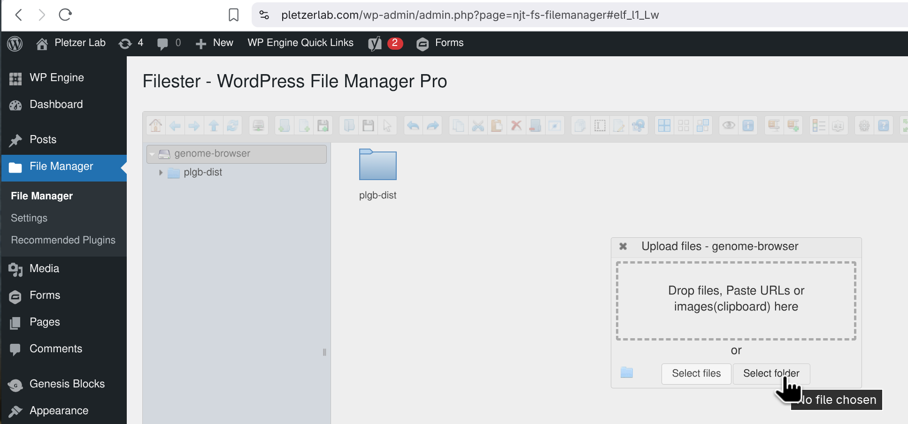
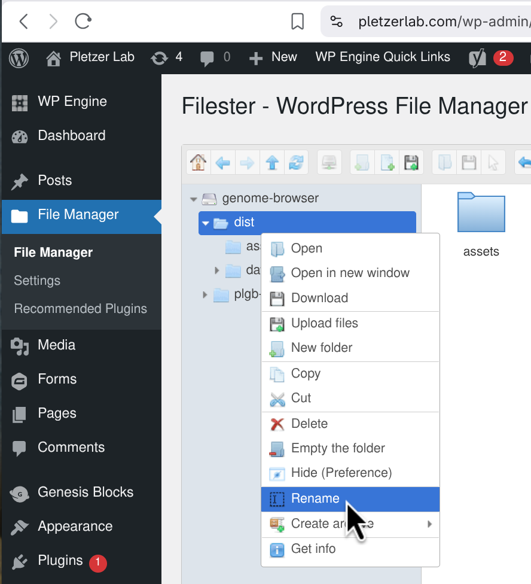

# Pletzer Lab Genome Browser
Genome browser website and related scripting utilities for data-processing and re-building site.
Made for Pletzer Lab by Elliott Brown.

## **Setup**
On first use, you must setup the dependencies for this project.

1. **Change into the root directory of this project:**

   ```bash
   cd pletzer-lab-genome-browser/
   ```
---

2. **Install missing packages:**
  
    **To hopefully automate download process, try:**
    ```bash
    scripts/deps-check.sh
    ```

    On Ubuntu or MacOS (macOS requires 'brew' package manager), the script should prompt you to install packages automatically (recommended).

    **Alternatively**, you can install dependencies manually:
      - Install the missing listed packages. These are:
        1. nodeJS/NPM (recommend version 24 LTS, but any should work).
        2. python3 ("python" command should point to python3, recommend 3.12 but any should work if python3).
        3. conda
        4. perl (for bioinformatics commands)

      - Install npm dependencies (dependencies for building the website):
        ```bash
        npm install
        npm install -g @jbrowse/cli
        ```
      
      - Install conda dependencies (dependencies for bioinformatics tools):
        ```bash
        conda env create --name plgb --file requirements.yaml 
        ```
      
      - If you're struggling to get this working, I'd seriously recommend using a Ubuntu virtual machine / docker - as it will make installation fast and automatic.
---

3. **Run this to make sure commands are available for python:**
    ```bash
    export PATH="$HOME/miniconda3/bin:$PATH"
    source ~/.bashrc
    conda init
    conda activate plgb
    ```
---

## **User Guide**

To rebuild the website with new data, follow the steps below:


1. **Change into the root directory of this project and activate conda:**

   ```bash
   cd pletzer-lab-genome-browser/
   conda activate plgb
   ```
---

2. **Create a directory structure like so:**

    ```text
      data/
      ├── genome1_name/
      │   ├── refseq.fna
      │   ├── genes.gff
      │   └── experiments/
      │       └── experiment1_name/
      │           ├── (optional) info.txt
      │           ├── condition1_name/
      │           │   ├── condition1.1.bam
      │           │   ├── condition1.2.bam
      │           │   ├── ...
      │           │   └── condition1.N.bam
      │           └── condition2_name/
      │               ├── cond2.1.bam
      │               ├── cond2.2.bam
      │               ├── ...
      │               └── cond2.N.bam
      │
      └── genome2_name/
          ├── ...

    ```

    Note:
    - `refseq.fna` is the reference sequence FASTA file, containing the nucleotide sequence.
    - `genes.gff` is the genes file, containing the coordinates and names for each gene.
    - `reads/` - contains BAM files. Make sure it follows the structure shown above. BAM files **must** have extension `.<sample_number>.bam` (e.g., `condition1.1.bam` for condition #1, sample #1).
    
      You may find `scripts/ncbi-download.sh` helpful to auto-download "refseq.fasta" and "genes.gff" from NCBI database. For example:
      ```bash
      scripts/ncbi-download.sh GCF_000026645.1 ./data/000026645.1_PA_LESB58
      ```
      The command above will automatically download the P.aeruginosa LESB58 nucleotide sequence and genes information. All you would need to do next is create the experiments/ directory structure.

---

3. **Run the build script on your data/ directory:**

    ```bash
    scripts/build.sh data \
        --yes \
        --skip-processed-bams \
        --bin-size=10 \
        --n-threads=5
    ```

    The command above uses a some arguments to control its output:
     - 'data' means to process genome files from the relative directory ./data
     - '--yes' makes the script run without waiting for user input
     - '--skip-processed-bams' make the script skip processing for any BAM file where a BigWig (.bw) file already exists of the same name (BigWig is the final output format for the website). Adding this option can massively speed up the build-process, but may cause issues if bad BigWig files are present.
     - '--bin-size=10' sets the bin size to 10 when processing BAM files. Values are averaged over every bin-size values (e.g., with --bin-size=3, the values (1,2,3,4,5,6) become (2,2,2,5,5,5)). Bin size of 10 is the default. Also keep in mind that while lower bin sizes are more visually precise at high resolution, the size of the BigWig will be exponentially larger.
     - '--n-thread=5' make the script attempt to use that many threads while processing BAM files. Generally, higher values should speed up the script (but on low-end computers that do not have enough threads, it could cause issues). The default is 1 thread.
   
    Once the command completes successfully, the newly-built website is stored in the [./dist](./dist/) directory. This directory contains all data and files required for the page to work on a web server. More information on deployment is given below.

    If the data is malformed, the script will abort and list errors.

    ### Common build errors:
    - Chromosome names are inconsistent:
        A common issue will be that the names of chromosomes are not consistent across files. For example:
        ```bash
        ./scripts/build.sh /path/to/data/
        ```
        ```text
        Checking for errors...
        [OK] GCF_000006765.1 (P.aeruginosa PA01)
        [FAIL] GCF_000013465.1 (S.aureus USA300LAC)
            - Mismatch in 'BF_SA_BF.1.bam': [ CP000255.1 ] not in reference: [ NC_007793.1, NC_007790.1 ]
            - Mismatch in 'BF_SA_BF.2.bam': [ CP000255.1 ] not in reference: [ NC_007793.1, NC_007790.1 ]
        Aborting due to errors.
        ```
    
        If we know that "CP000255.1" chromosome maps to "NC_007793.1", we can fix this by renaming the chromosome in the BAM file to match the reference sequence using `scripts/bam-reheader`:
        ```bash
        scripts/bam-reheader /path/to/BF_SA_BF.1.bam "CP000255.1" "NC_007793.1"
        # After this, there will be two files:
        #  - BF_SA_BF.1.bam.ORIGINAL (the original file with mismatched chromosomes - these are ignored during build)
        #  - BF_SA_BF.1.bam (the fixed file)
        ```
        
      This script may be helpful for investigating chromosomes names:
      ```bash
      scripts/chromosome-check.py --verbose
      ```
    ---

4. To preview your website, run the following command:
    ```bash
    npm start
    ```
    This will launch a simple web server, serving the contents of the [./dist](./dist/) directory on [localhost:3000](http://localhost:3000).

5. Once happy, copy the entire "dist/" folder to your web server or hosting provider.

    **WordPress deployment on pletzerlab.com:**
    1. Go to the [Pletzer Lab Wordpress Admin Dashboard](https://pletzerlab.com/backend-login/) and login.
    2. In the sidebar, click 'File Manager'. This directory points to the 'genome-browser' folder, in which 'plgb-dist' is the deployed website.
    3. Click the upload button, select 'Upload Folder', and upload your generated [dist/](./dist/) directory
        
    4. Rename the uploaded `dist` folder to `plgb-dist`. The page at this URL will be automatically detected by the website and used as the official deployment.
        
    5. It should now be available at [pletzerlab.com/genome-browser](https://pletzerlab.com/genome-browser)!

    **More information on deployment:**
    The type of website outputted is known as a 'static website':
      - A static site is a website in its simplest form - a simple folder containing an "index.html" file (that's the webpage), and any other arbitrary data the page may use.
      - Importantly, that means that your web provider / server bears the responsibility of serving that folder, and given there are no external assets used in this project (i.e., no external dependencies such as databases, this website is fully self-contained), then this website should be as secure as your server is.
      - Almost any web provider or server can serve static files. Just drop the directory where you wish.

## Developer Guide

#### Install dependencies:
```bash
scripts/deps-check.sh # automated on Ubuntu
```

#### Run dev server:
```bash
npm run dev
```

#### Build for production:
```bash
npm run build # prod-ready static website, output to ./dist/
```

#### Run production build:
```bash
npm start
```

### Project structure

- #### [scripts](./scripts) directory
Scripts for processing bioinformatics data and building the project.

- #### [src](./src) directory
Source code for the website.

- #### [public](./public) directory
Public assets for the website (e.g., images, data, styles).

- #### [dist](./dist) directory
After running the build script, the outputted website files will be here. Run the directory as a server (e.g., "npx serve -S ./dist") to make the website available on [localhost:3000](http://localhost:3000).

### Forked from "vite with @jbrowse/react-linear-genome-view"

This is a demo of using the linear genome view with vite (see
https://vitejs.dev/)

Vite is a build system that is very fast and becoming more popular, using
esbuild and rollup instead of webpack

This particular demo includes several polyfills that are needed for JBrowse
including the Buffer polyfill

### For testing:
1. it is important to visually confirm graph against the processed BigWigs. The bigwigToBedgraph utility was used
after changes to check the output numbers of the BigWig to graph.
2. bigwigAverage was confirmed to give mean result - use simple test cases.
See ./test/ for details.

## My Story

My time at Pletzer Lab has been an interesting journey! 
Me, a computer scientist, working in the Microbiology building for a Summer Student Internship job.
The job had been advertised as creating interactive website charts for data, which I have had an interest in, having made a surf forecast project of my own (of a similar nature, though this was certainly a much bigger challenge).

At first - lacking a lot of fundamental knowledge of genetics (and biology in general) - my first assignment was to learn. I became accustomed to the base nucleotides (ACGT/U) that make up DNA and RNA, how RNA is copied from DNA and can be used as messenger for gene expression, how gene expression can give different experimental results, for example, an infected culture may express different genes to a control group. It was fascinating learning about the consequences of this: how we can use these results to study bacterial resistance to antibiotics.

More relevant to my work was the raw data associated with RNA-sequencing (RNA-seq), and how this was processed. 
Many such files exist:
  - FASTA/FASTQ files, which are simple and just describe a sequence of nucleotides at certain read positions. These were used in my project as the reference genome - the DNA sequence that is well known, studied and confirmed in the NCBI database. We can use a reference like this to align all the raw 'reads' to (reads for RNA-seq are often 50-200bp, which is usually unique enough to identify the position this should fit, more on that soon). 
  - GFF3 files, which are not well-standardised and in addition to including start/stop positions for genes and their names, may include all sorts of other metadata.
  - BAM files, which are effectively somewhat standardised and filtered raw reads data. They include positions (start/stop) for ALL the reads, which can be many thousands, and often include a quality score to indicate confidence of alignment and nucleotide along with extra metadata. These files are huge: often gigabytes, and that's just for bacteria...
  - BigWig files can include number of reads per position, which is extracted from the BAM file (in my case, with the 'bamCoverage' program provided by deeptools). A 'bin size' must be provided, which averages across that many values and repeating at every value divisble by that number without a remainder (for example, (1, 2, 3, 4, 5, 6) averaged with a bin size of 3 is (2, 2, 2, 5, 5, 5) output).

JBrowse2 Web was shown to me by post-doc Sam. I used this library to help build the graphs (which reduced my workload, as it is a well-known and tested genomic browser). With this, I was able to customise it to the needs of the department - in particular, for comparing coverage between bacteria (read counts). This allows us to determine how much a gene is expressed. I decided to use React and Vite for web development side - as there was a template available for me to build on, and I am comfortable enough with React (Vite is the build system which packages HTML/CSS/JS into smaller chunks).

To build the website, bioinformatics tools are required to check for errors, and convert the raw 'BAM' files into BigWig files, readable by JBrowse. My script 'scripts/build.sh' handles this and builds the website with Vite.
